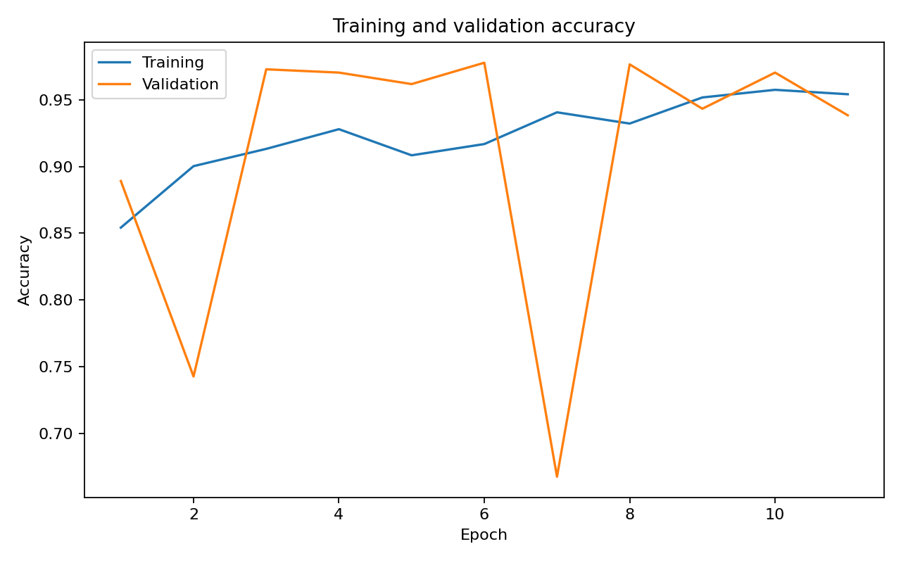
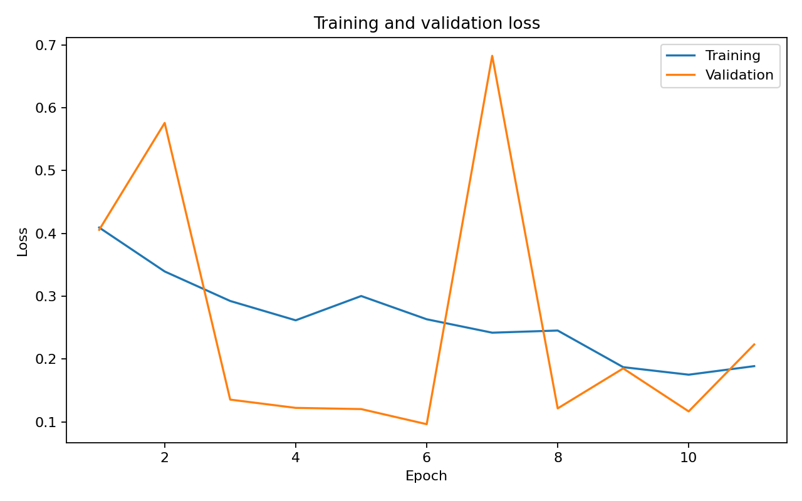
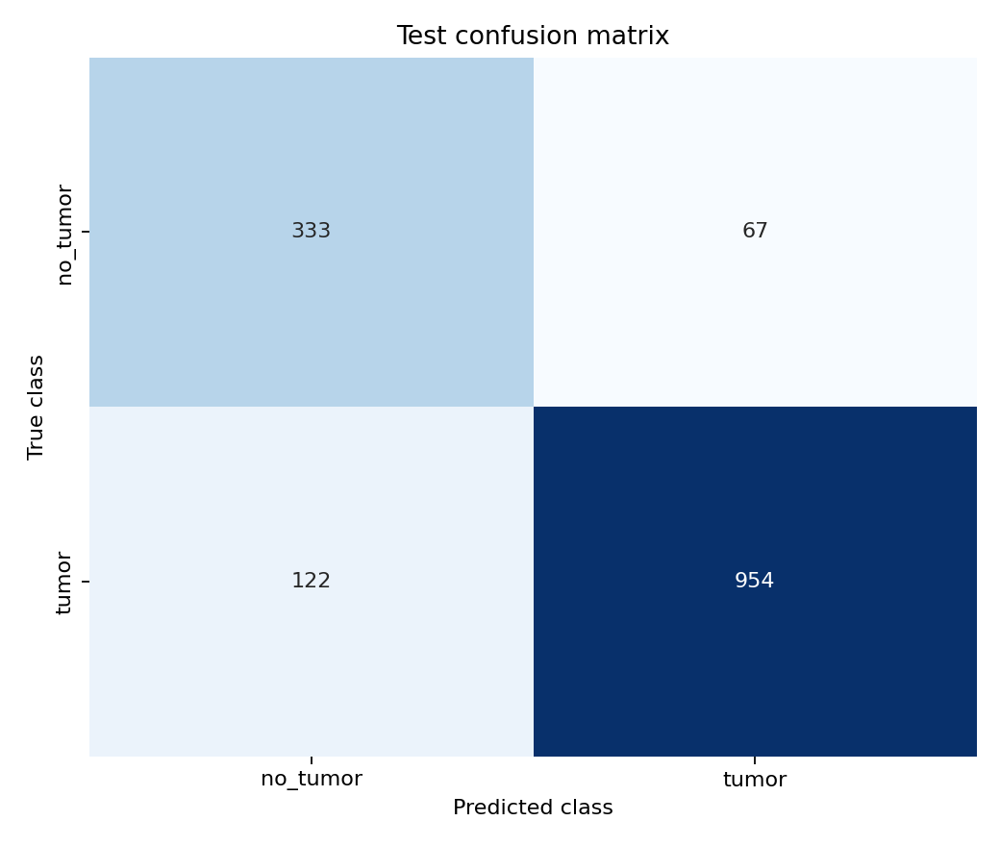
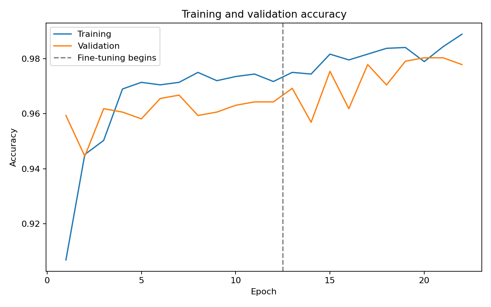
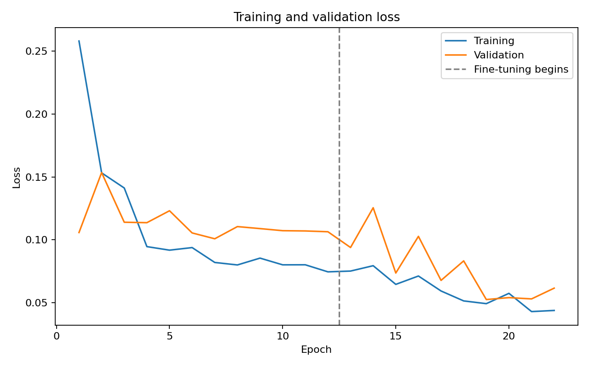
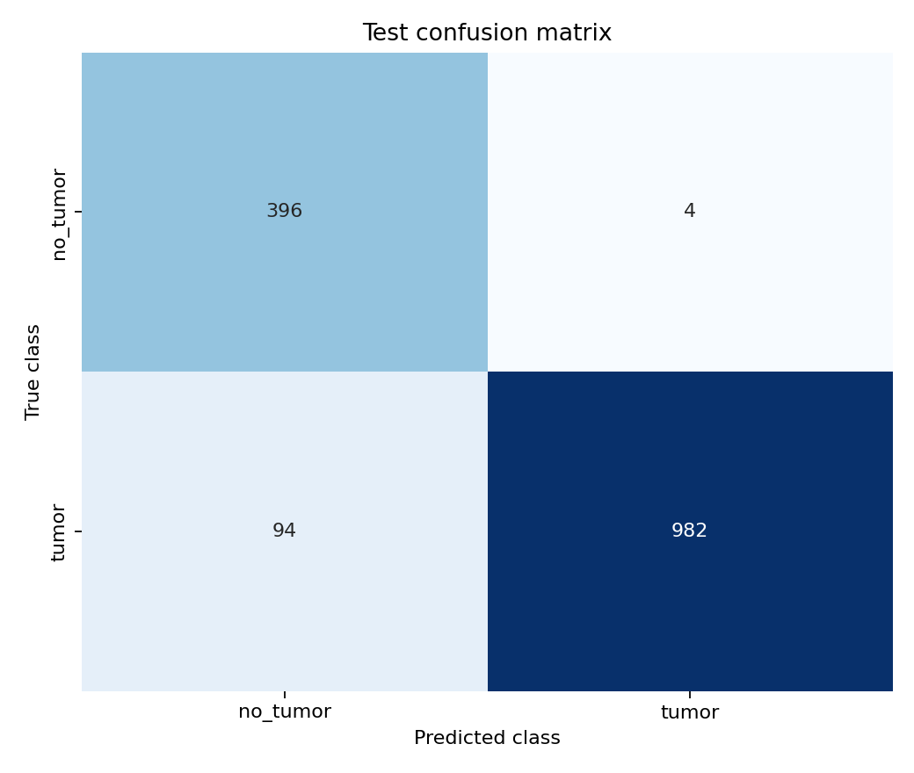
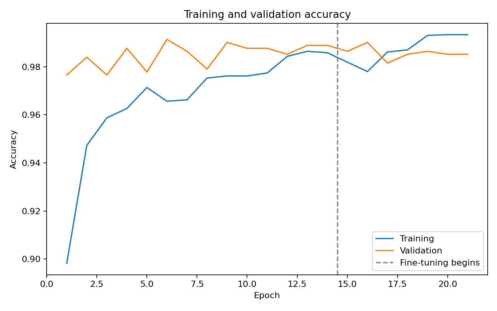
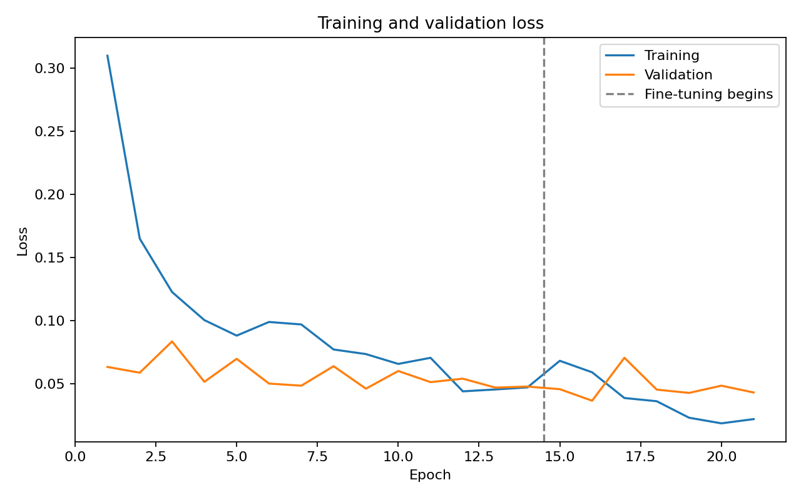
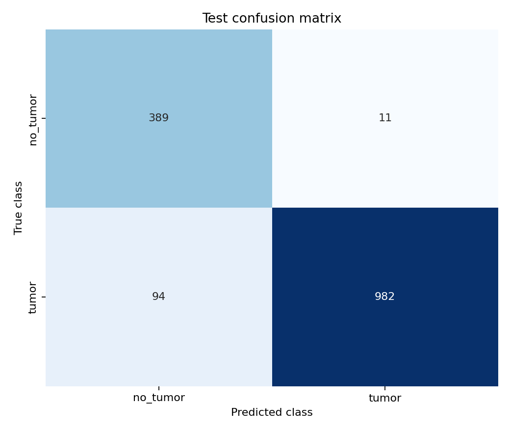

# Measured results

## Dataset and evaluation protocol

The audit inspected 7,200 images and retained 5,608. It excluded 1,592 images for the reasons recorded below.

- exact_duplicate_of: 314.
- explicit_augmentation_marker: 203.
- development_group_overlaps_official_test: 1,075.

| Split | Glioma | Meningioma | No Tumor | Pituitary | Total |
|---|---:|---:|---:|---:|---:|
| Train | 1029 | 898 | 427 | 966 | 3320 |
| Validation | 254 | 220 | 107 | 231 | 812 |
| Test | 383 | 293 | 400 | 400 | 1476 |

The eligible official Testing assignment was preserved. Checkpoint selection uses validation loss. The binary decision threshold is 0.5; it must be selected independently of test performance. EfficientNet is the designated application model. Perceptual filtering is conservative. Patient independence cannot be established because no patient mapping is available.

Manifest SHA-256: `7cbfdfaf4cb792140f3144366a6f56b31d0d1ecd8a866e6d4749dd874927715a`.

## Held-out comparison

| Model | Accuracy | Precision | Recall | F1 | Specificity | ROC-AUC |
| --- | --- | --- | --- | --- | --- | --- |
| Custom CNN | 0.8720 | 0.9344 | 0.8866 | 0.9099 | 0.8325 | 0.9332 |
| EfficientNetB0 | 0.9336 | 0.9959 | 0.9126 | 0.9525 | 0.9900 | 0.9850 |
| MobileNetV2 | 0.9289 | 0.9889 | 0.9126 | 0.9493 | 0.9725 | 0.9820 |

Task: binary. Threshold: 0.5. Test images: 1476.

All available measured rows use the same saved split manifest. This is an image-level research comparison, not clinical validation.

Values are fractions on a 0–1 scale. These are measured image-classification results on this dataset, not clinical validation or calibrated diagnostic probabilities.

## Custom CNN

Selected checkpoint: **baseline, epoch 6**; validation loss **0.09641**. The run completed 11 epochs across its phases in 34.6 minutes (recorded training wall time).

- baseline: 11 epochs; stopped by early_stopping; best validation loss 0.09641 at epoch 6.

### Training/validation behavior

Across the recorded run, training accuracy changed from 0.8542 to 0.9542, and validation accuracy from 0.8892 to 0.9384. Training loss changed from 0.4092 to 0.1888; validation loss from 0.4056 to 0.2233.

Validation loss ranged from 0.0964 to 0.6824. The final validation loss exceeded the selected checkpoint's loss, so retaining the earlier best checkpoint avoids using the later degraded state. Variation or spikes in validation loss should be inspected directly; a smooth overfitting trend is not assumed.

There were 3 within-phase epoch transitions with falling training loss and rising validation loss. This is a signal to inspect generalization, not a standalone diagnosis of overfitting. Training uses augmentation and dropout; validation uses deterministic inputs and inference mode. Training also uses class-weighted loss while validation is unweighted, so the absolute losses are not identical objectives. Early stopping, dropout, augmentation, and validation-triggered learning-rate reduction were applied. The last epoch is not automatically the deployed checkpoint.

Held-out outcomes: TN=333, FP=67, FN=122, TP=954. False negatives are labeled tumor images classified as no tumor; false positives are labeled no-tumor images classified as tumor.

Detailed metrics, probabilities, and model SHA-256 are in [the Custom CNN evaluation folder](../results/evaluation/custom_cnn/).

## EfficientNetB0

Selected checkpoint: **finetune, epoch 7**; validation loss **0.05252**. The run completed 22 epochs across its phases in 60.0 minutes (recorded training wall time).

- head: 12 epochs; stopped by early_stopping; best validation loss 0.10084 at epoch 7.
- finetune: 10 epochs; stopped by epoch_limit; best validation loss 0.05252 at epoch 7.

### Training/validation behavior

Across the recorded run, training accuracy changed from 0.9069 to 0.9889, and validation accuracy from 0.9594 to 0.9778. Training loss changed from 0.2581 to 0.0438; validation loss from 0.1058 to 0.0616.

Validation loss ranged from 0.0525 to 0.1535. The final validation loss exceeded the selected checkpoint's loss, so retaining the earlier best checkpoint avoids using the later degraded state. Variation or spikes in validation loss should be inspected directly; a smooth overfitting trend is not assumed.

There were 4 within-phase epoch transitions with falling training loss and rising validation loss. This is a signal to inspect generalization, not a standalone diagnosis of overfitting. Training uses augmentation and dropout; validation uses deterministic inputs and inference mode. Training also uses class-weighted loss while validation is unweighted, so the absolute losses are not identical objectives. Early stopping, dropout, augmentation, and validation-triggered learning-rate reduction were applied. The last epoch is not automatically the deployed checkpoint.

Held-out outcomes: TN=396, FP=4, FN=94, TP=982. False negatives are labeled tumor images classified as no tumor; false positives are labeled no-tumor images classified as tumor.

Detailed metrics, probabilities, and model SHA-256 are in [the EfficientNetB0 evaluation folder](../results/evaluation/efficientnet/).

## MobileNetV2

Selected checkpoint: **finetune, epoch 2**; validation loss **0.03669**. The run completed 21 epochs across its phases in 47.0 minutes (recorded training wall time).

- head: 14 epochs; stopped by early_stopping; best validation loss 0.04621 at epoch 9.
- finetune: 7 epochs; stopped by early_stopping; best validation loss 0.03669 at epoch 2.

### Training/validation behavior

Across the recorded run, training accuracy changed from 0.8982 to 0.9934, and validation accuracy from 0.9766 to 0.9852. Training loss changed from 0.3096 to 0.0221; validation loss from 0.0634 to 0.0432.

Validation loss ranged from 0.0367 to 0.0836. The final validation loss exceeded the selected checkpoint's loss, so retaining the earlier best checkpoint avoids using the later degraded state. Variation or spikes in validation loss should be inspected directly; a smooth overfitting trend is not assumed.

There were 7 within-phase epoch transitions with falling training loss and rising validation loss. This is a signal to inspect generalization, not a standalone diagnosis of overfitting. Training uses augmentation and dropout; validation uses deterministic inputs and inference mode. Training also uses class-weighted loss while validation is unweighted, so the absolute losses are not identical objectives. Early stopping, dropout, augmentation, and validation-triggered learning-rate reduction were applied. The last epoch is not automatically the deployed checkpoint.

Held-out outcomes: TN=389, FP=11, FN=94, TP=982. False negatives are labeled tumor images classified as no tumor; false positives are labeled no-tumor images classified as tumor.

Detailed metrics, probabilities, and model SHA-256 are in [the MobileNetV2 evaluation folder](../results/evaluation/mobilenet/).

## Interpretation limits

These experiments use one public collection and one seeded split. Patient independence cannot be established because no patient mapping is available. There is no independent external validation, calibration study, or clinical approval. Filtering substantially changes class proportions and may exclude visually similar but distinct images. Inspect specificity and sensitivity together; high accuracy can obscure class imbalance. Grad-CAM is an interpretability aid and does not validate anatomical localization.

CPU experiment wall times may overlap and are not controlled performance benchmarks. See [the verification record](verification.md) for the actual execution environment and software checks.

The three-model study is a sequential extension: the original CNN/EfficientNet test results and sample mistakes had already been inspected before MobileNetV2 was added. MobileNetV2 used the recorded fixed training defaults, seed 42, threshold 0.5, and validation-only checkpoint selection. Reusing this previously inspected holdout makes the comparison exploratory; it is not fresh external confirmation or evidence of statistical significance. See [the recorded protocol](../paper/experiment_protocol.md).
